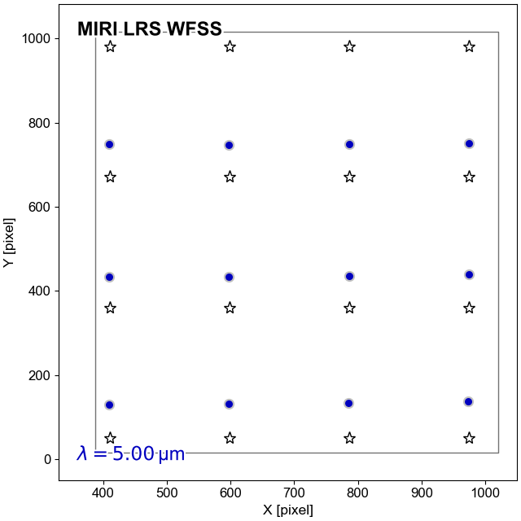
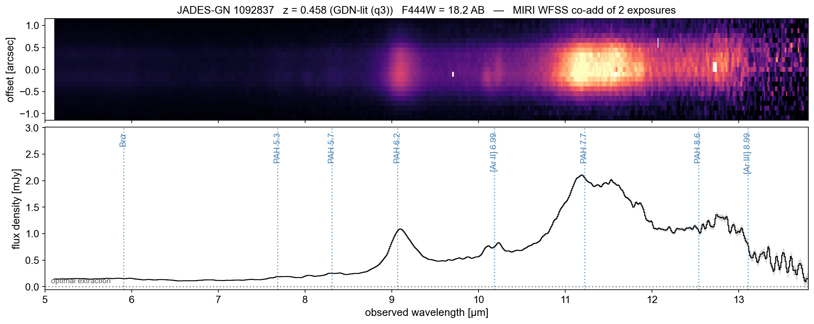

# miri_wfss

JWST MIRI prism (P750L) wide-field slitless spectroscopy — calibration reference files and extraction workflow, produced by Fengwu Sun.

When the MIRI LRS prism is used without the slit on the FULL imager array, every source in the illuminated field produces a dispersed mid-infrared spectrum (4.7–13.8 µm) — wide-field slitless spectroscopy (WFSS). Several archival JWST programs observed this way, but at the time of this writing (June 2026), there is no STScI pipeline support for extracting these data to my knowledge. This repository provides both the calibration and a complete, worked extraction path:

- **`data/cal_v1.0/`** — the `MIRI_WFSS_CAL_v1.0` calibration suite: flat field, master sky v5 (consensus-patched, with an additive detector-defect map and optional PCA components), WFSS region mask, spectral tracing and dispersion polynomial tables (v2.1), and absolute response fR(λ) (v2, CALSPEC-anchored), with a SHA-256 manifest. The position dependence of the response (L-flat) was tested and is consistent with identity, so no L-flat correction is applied or shipped. See `data/cal_v1.0/README.md` for the calibration model and file details.
- **`MIRI_WFSS_extraction_example_FSun.ipynb`** — one self-contained notebook that turns public MIRI P750L FULL `rate` files into flux-calibrated 2D + 1D spectra: flat + sky calibration, WCS attachment, trace rectification, flux calibration, PA-grouped sigma-clipped co-addition, and boxcar/optimal 1D extraction. Committed with executed outputs so you can read the full worked example without running anything.
- **`download_goodsn_example_rates.sh`** — fetches the example dataset (GO-4192; PI: Alberts, GOODS-N: 8 × 364 s P750L exposures, ~170 MB) directly from MAST.
- **`data/catalogs/goodsn_example_sources.csv`** — the 9 galaxies with literature spectroscopic redshifts covered by the example exposures.

If you have any question, please do not hesitate to contact me via my email: sunfengwu在westlake.edu.cn

If you find the calibration products and/or this workflow helpful, it would be great if you could acknowledge it in your research and cite the MIRI WFSS calibration + atlas paper: **Sun (2026), "AI-Assisted Calibration of JWST/MIRI Prism Wide-Field Slitless Spectroscopy: Methodology, Performance, and a Mid-Infrared Spectral Atlas of Galaxies at z = 0–4 in the GOODS Fields"** (in preparation; the arXiv/ADS link will appear here as soon as it is public, see also `CITATION.cff`).

## Quick start

```bash
git clone https://github.com/fengwusun/miri_wfss.git
cd miri_wfss
sh download_goodsn_example_rates.sh        # ~170 MB from MAST, public
jupyter notebook MIRI_WFSS_extraction_example_FSun.ipynb
```

**Environment**: `numpy`, `scipy`, `astropy`, `matplotlib`, and — only for the WCS-attachment step — the [`jwst`](https://jwst-pipeline.readthedocs.io/) pipeline. The simplest route is a [`stenv`](https://stenv.readthedocs.io/) environment, which contains everything. Tested with python 3.11, `jwst` 1.18.0, astropy 7.0, numpy 1.26, scipy 1.17.

**CRDS**: the WCS step queries the JWST Calibration Reference Data System. If you have never used CRDS, the notebook defaults to

```bash
export CRDS_SERVER_URL=https://jwst-crds.stsci.edu
export CRDS_PATH=$HOME/crds_cache
```

and the first run downloads a few MIRI imaging reference files (~100 MB) into that cache. If you already have a CRDS setup, your environment variables are respected.

## What the notebook does

| Step | Content |
|---|---|
| 0 | setup: paths, CRDS, detector constants |
| 1 | download/inventory the example GO-4192 rate files |
| 2 | inspect a raw P750L FULL frame (sky-dominated, WFSS region) |
| 3 | rate → "lv1.5": flat-field + additive defect map + scaled master-sky subtraction + per-row de-banding (mode A; optional PCA mode B) |
| 4 | attach a celestial WCS (`jwst` `AssignWcsStep` in imaging mode) and write lv1.5 files |
| 5 | load the source catalog; footprint coverage check |
| 6 | rectify a dispersed trace (v2.1 trace + wavelength polynomials, DQ masking, local background) |
| 7 | flux-calibrate with the response fR(λ); single-exposure spectrum |
| 8 | co-add exposures: PA grouping, sigma-clipped weighted mean, pairwise N = 2 rejection |
| 9 | 1D extraction: small-aperture boxcar + optimal (Horne), measured/Gaussian/imaging profiles |
| 10 | atlas-style 2D + 1D figures and `.ecsv` spectra for all 9 example sources |
| 11 | caveats & tips (saturation, contamination, band edges, extended sources, …) |

The trace + dispersion model in action (generated in step 6 of the notebook): each white star is a virtual source, and the colored dots mark its dispersed position as wavelength increases — dispersion runs along −y with a slight position-dependent tilt in x.



Example output (GN 1092837, z = 0.458, the brightest source in the example field):



## Calibration accuracy (v1.0)

| Component | Accuracy | Validation |
|---|---|---|
| Trace | MAD 0.055 px | 4,209 LMC point sources |
| Wavelength | 0.10–0.25 resolution element (220–610 km/s RMS) | PN + galaxy lines, 7.9–13.1 µm |
| Flux, 7.4–13.8 µm | σ(fR)/fR = 0.3%; 1–2% absolute | CALSPEC standard, direct |
| Flux, 4.7–7.4 µm | ~5% shape | stellar ensemble, overlap-tied |
| L-flat | identity; max \|L−1\| = 0.010 (no correction applied) | CALSPEC 5-position grid; galaxy repeats MAD 4.4% |
| End-to-end | field star 1.016 ± 0.042; PN vs F560W image 1.01 (EE-corrected) | 2MASS/WISE SED; CAL-9505 visit |

Full derivation, validation, and the GOODS-N/GOODS-S/LMC spectral atlas: Sun (2026).

## Data credits

The example data are from JWST program GO-4192 (PI: S. Alberts). The calibration suite is built from public exposures of GO-3224 (PI: J. McKinney), GO-4192, GO-4762 (PI: S. Fujimoto), GO-8544 (PI: J. Helton), CAL-9505 and CAL-9265 (PI: A. Petric), obtained from the [Mikulski Archive for Space Telescopes](https://mast.stsci.edu) (MAST) at the Space Telescope Science Institute. Source coordinates, F444W photometry, and redshift compilations draw on the JADES GOODS-N data release 5 ([Eisenstein et al. 2026](https://ui.adsabs.harvard.edu/abs/2026ApJS..283....6E/abstract); [Johnson et al. 2026](https://ui.adsabs.harvard.edu/abs/2026arXiv260115954J/abstract); [Robertson et al. 2026](https://ui.adsabs.harvard.edu/abs/2026arXiv260115956R/abstract)) and literature spectroscopic surveys of GOODS-N.

#### v1.0.0 (2026.06.12):
- Initial public release: `MIRI_WFSS_CAL_v1.0` calibration suite (trace/wavecal v2.1, fluxcal v2, flat v3, sky v5), extraction example notebook on GO-4192 GOODS-N data, example source catalog, MAST download script.
- 2026.06.11 background refresh (sky v5): consensus-patched master sky with an additive detector-defect map (subtracted unscaled; defect pixels DQ-flagged) and per-row sigma-clipped de-banding in the lv1.5 step; outlier-patched PCA basis for mode B.
- 2026.06.11 rectification robustness: per-exposure rejection of corrupted-low pixels (cosmic-ray-shower skirts and badly corrected jumps, often unflagged in DQ) against a running median along the trace; masked pixels propagate as empty into the co-add and are filled from the other exposures — essential for 2-exposure co-adds at near-identical dithers.
- A Zenodo DOI and the full 182-source GOODS spectral atlas will be linked here with the paper.
