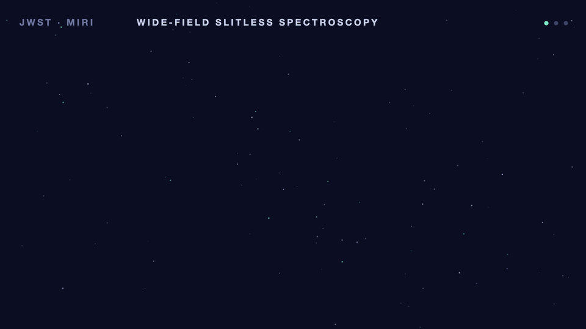
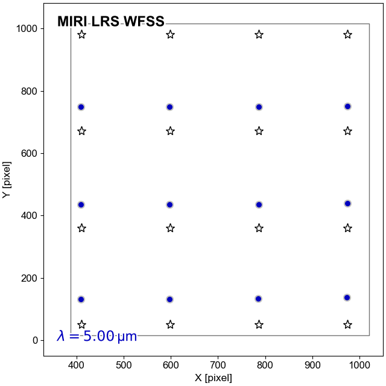
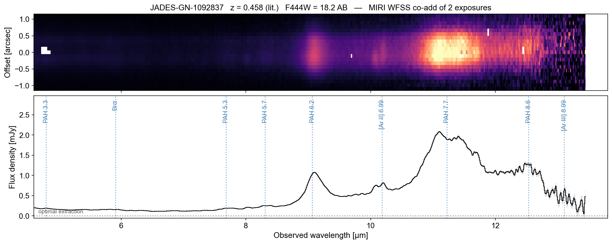

# miri_wfss

[](https://arxiv.org/abs/2609.20935)
[](https://doi.org/10.5281/zenodo.21944431)

This Github repo presents the calibration reference files and extraction workflow of **JWST MIRI prism (P750L) wide-field slitless spectroscopy**.

When the MIRI LRS prism is used without the slit on the FULL imager array, every source in the illuminated field produces a dispersed mid-infrared spectrum (4.7–13.5 µm). This will effectively conduct wide-field slitless spectroscopy (WFSS). Several archival JWST programs observed this way, but at early June 2026 when this GitHub repo was created, there was no STScI pipeline support for extracting these data to my knowledge. (2026-09-17 added: See also [Kendrew et al. 2026](https://ui.adsabs.harvard.edu/abs/2026arXiv260916239K/abstract) for an independent MIRI WFSS survey of the HUDF by the MIRI EU instrument team). 



*MIRI WFSS in 15 seconds ([higher-quality MP4](media/miri_wfss_explainer.mp4)).*

This repository provides both the calibration and a complete, worked extraction path:

- **`data/cal_v1.2/`** — the `MIRI_WFSS_CAL_v1.2` calibration suite: flat field, master sky (v5, consensus-patched, with an additive detector-defect map and optional PCA components), WFSS region mask, spectral tracing (v2.1) and dispersion (v4, anchored to MIRI/MRS) polynomial tables, and absolute response fR(λ) (v4, anchored to CALSPEC), with a SHA-256 manifest. The position dependence of the response (L-flat) was tested and is consistent with identity, so no L-flat correction is applied or shipped. Please see `data/cal_v1.2/README.md` for the calibration model and file details.
- **`MIRI_WFSS_extraction_example_FSun.ipynb`** — one self-contained notebook that turns public MIRI P750L FULL `rate` files into flux-calibrated 2D + 1D spectra: flat + sky calibration, WCS attachment, trace rectification, flux calibration, PA-grouped sigma-clipped co-addition, and boxcar/optimal 1D extraction. Committed with executed outputs so you can read the full worked example without running anything.
- **`download_goodsn_example_rates.sh`** — fetches the example dataset (GO-4192; PI: Alberts, GOODS-N: 8 × 364 s P750L exposures, ~170 MB) directly from MAST.
- **`data/catalogs/goodsn_example_sources.csv`** — the 9 galaxies with literature spectroscopic redshifts covered by the example exposures.

If you have any question or comments, please do not hesitate to contact me via my email: sunfengwu在westlake.edu.cn

If you find the calibration products and/or this workflow helpful, it would be great if you could acknowledge it in your research and cite the MIRI WFSS calibration + atlas paper: **Sun et al. (2026), "An Archival Calibration of JWST/MIRI Prism Wide-Field Slitless Spectroscopy: Methodology, Performance, and a Mid-Infrared Spectral Atlas of Galaxies at z = 0–4 in the GOODS-N/S Fields"** ([arXiv:2609.20935](https://ui.adsabs.harvard.edu/abs/2026arXiv260920935S/abstract); see also `CITATION.cff`). The calibration suite and pipeline are archived on Zenodo: concept DOI [10.5281/zenodo.21944431](https://doi.org/10.5281/zenodo.21944431) (always resolves to the latest version); latest archived release (v1.2): [10.5281/zenodo.22803722](https://doi.org/10.5281/zenodo.22803722).

## Quick start

```bash
git clone https://github.com/fengwusun/miri_wfss.git
cd miri_wfss
sh download_goodsn_example_rates.sh        # ~170 MB from MAST, public
jupyter notebook MIRI_WFSS_extraction_example_FSun.ipynb
```

**Environment**: `numpy`, `scipy`, `astropy`, `matplotlib`, and — only for the WCS-attachment step — the [`jwst`](https://jwst-pipeline.readthedocs.io/) pipeline. The simplest route is a [`stenv`](https://stenv.readthedocs.io/) environment, which contains everything. Tested with python 3.11, `jwst` 1.18.0, astropy 7.0, numpy 1.26, scipy 1.17.

**CRDS**: the WCS step queries the JWST Calibration Reference Data System. If you have never used CRDS, the notebook defaults to

```bash
export CRDS_SERVER_URL=https://jwst-crds.stsci.edu
export CRDS_PATH=$HOME/crds_cache
```

and the first run downloads a few MIRI imaging reference files (~100 MB) into that cache. If you already have a CRDS setup, your environment variables are respected.

## What the notebook does

| Step | Content |
|---|---|
| 0 | setup: paths, CRDS, detector constants |
| 1 | download/inventory the example GO-4192 rate files |
| 2 | inspect a raw P750L FULL frame (sky-dominated, WFSS region) |
| 3 | rate → "lv1.5": flat-field + additive defect map + scaled master-sky subtraction + per-row de-banding (mode A; optional PCA mode B) |
| 4 | attach a celestial WCS (`jwst` `AssignWcsStep` in imaging mode) and write lv1.5 files |
| 5 | load the source catalog; footprint coverage check |
| 6 | rectify a dispersed trace (v2.1 trace + v4 wavelength polynomials, DQ masking, local background) |
| 7 | flux-calibrate with the response fR(λ); single-exposure spectrum |
| 8 | co-add exposures: PA grouping, sigma-clipped weighted mean, pairwise N = 2 rejection |
| 9 | 1D extraction: small-aperture boxcar + optimal (Horne), measured/Gaussian/imaging profiles |
| 10 | atlas-style 2D + 1D figures and `.ecsv` spectra for all 9 example sources |
| 11 | caveats & tips (saturation, contamination, band edges, extended sources, …) |

The trace + dispersion model in action (generated in step 6 of the notebook): each white star is a virtual source, and the colored dots mark its dispersed position as wavelength increases — dispersion runs along −y with a slight position-dependent tilt in x.



Example output (GN 1092837, z = 0.458, the brightest source in the example field):



## Calibration accuracy (v1.2)

| Component | Accuracy | Validation |
|---|---|---|
| Trace | MAD 0.055 px | 4,209 LMC point sources |
| Wavelength | RMS 9 nm, max 14 nm (~0.1 resolution element), 6.3–12.6 µm | MIRI/MRS spectrum of the calibration PN (external) |
| Flux, 7.4–13.45 µm | σ(fR)/fR = 0.3%; 1–2% absolute | CALSPEC standard, direct |
| Flux, 4.7–7.4 µm | ~5% shape | stellar ensemble, overlap-tied |
| L-flat | identity; max \|L−1\| = 0.016 (no correction applied) | CALSPEC 5-position grid; star repeats MAD 1.4% |
| End-to-end | field star 1.016 ± 0.042; PN vs F560W image 1.01 (EE-corrected) | 2MASS/WISE SED; CAL-9505 visit |

Full derivation, validation, and the GOODS-N/GOODS-S/LMC spectral atlas: [Sun et al. (2026), arXiv:2609.20935](https://ui.adsabs.harvard.edu/abs/2026arXiv260920935S/abstract).

## Data credits

The example data are from JWST program GO-4192 (PI: S. Alberts). The calibration suite is built from public exposures of GO-3224 (PI: J. McKinney), GO-4192, GO-4762 (PI: S. Fujimoto), GO-8544 (PI: J. Helton), CAL-9505 and CAL-9265 (PI: A. Petric), obtained from the [Mikulski Archive for Space Telescopes](https://mast.stsci.edu) (MAST) at the Space Telescope Science Institute. Source coordinates, F444W photometry, and redshift compilations draw on the JADES GOODS-N data release 5 ([Eisenstein et al. 2026](https://ui.adsabs.harvard.edu/abs/2026ApJS..283....6E/abstract); [Johnson et al. 2026](https://ui.adsabs.harvard.edu/abs/2026arXiv260115954J/abstract); [Robertson et al. 2026](https://ui.adsabs.harvard.edu/abs/2026arXiv260115956R/abstract)) and literature spectroscopic surveys of GOODS-N.

#### v1.2 (2026.09.17):
- Wavelength calibration rebuilt on an external reference (v3.1 → v4): the MIRI/MRS spectrum of the calibration planetary nebula (SMP LMC 058 = LHA 120-N 133; [Jones et al. 2023](https://doi.org/10.1093/mnras/stad1609), JWST program CAL-1049) shows the object is low-excitation, so two previously adopted anchors were misidentified — “[Mg V] 5.610 µm” is the PAH 5.698 µm band and “[Ar V] 7.902 µm” is the PAH 7.834 µm complex blended with Pfund-α 7.460 / Humphreys-β 7.502 µm. v4 anchors the solution on the MRS spectrum itself (degraded to the WFSS line-spread function, feature-by-feature cross-correlation; 16 narrow-feature + 8 soft PAH-band anchors). Wavelengths shift by +53/+49/+35/+21/+9/−2/−3/+5 nm at 5/6/7/8/9/10.5/12/13.4 µm relative to v3.1. External accuracy against the MRS: RMS 9 nm, maximum 14 nm (~0.1 resolution element) over 6.3–12.6 µm — the v3.1 solution was blueshifted by up to 54 nm (1.3 px) at 6.3 µm.
- Flux calibration re-derived on the corrected wavelength scale (`FLUXCAL_LRS_WFSS_v4.dat`): CALSPEC-direct over 7.44–13.45 µm, blue ensemble tie 1.0535. At fixed observed wavelength, calibrated flux densities change by <1.5% except in the bluest bin (4.7 µm, −5%).
- Galaxy wavelength-anchor table cleaned: 13 duplicate rows removed; the PAH 7.7 µm anchors are recentred on the empirically measured complex peak (rest 7.63–7.59 µm instead of the nominal 7.65 µm; the flux-weighted centroid of the full complex sits at 7.8 µm but the recorded positions track the 7.6 µm sub-peak).

#### v1.1 (2026.08.08):
- Wavelength calibration corrected (v2.1 → v3.1): the red anchor of the planetary-nebula wavelength solution, previously identified as [Ar V] 13.102 µm, is [Ne II] 12.814 µm (the strongest PN line in this range in the ISO atlas of Bernard-Salas et al. 2001). Wavelengths shift by −41/−238/−353 nm at 11/12.8/13.5 µm relative to v2.1; residual RMS against the PN narrow lines improves to 87–144 km/s (0.03–0.08 resolution element) over 7.9–12.8 µm, validated against the PAH 11.3 µm band of the PN and of low-redshift GOODS galaxies.
- Flux calibration re-derived on the corrected wavelength scale (`FLUXCAL_LRS_WFSS_v3.1.dat`): CALSPEC-direct over 7.44–13.45 µm (was 7.44–13.81 µm on the wrong scale), blue ensemble tie 1.0492. At fixed observed wavelength, calibrated flux densities change by <2% blueward of 11 µm and by up to ~+25% at 13.4 µm (the wavelength relabeling on a steep response). The valid range is now 4.7–13.45 µm.
- The end-to-end field-star and PN photometric checks are carried over from v1.0 (the response changes by <2% over their 5–11 µm fit ranges). Example spectra re-extracted; `VERSION` and the SHA-256 manifest updated.

#### v1.0.1 (2026.06.14):
- Flux calibration, blue end: the ensemble-anchored response bins (`anchor=0`, 4.46–7.24 µm) were re-tied on the 7.5–9.0 µm CALSPEC overlap (scale 1.0423), shifting those bins by −0.33% from v1.0.0 — i.e. raising blue-end fluxes by 0.33%, well within the ~5% blue-shape uncertainty. The CALSPEC-direct red response (`anchor=1`, 7.44–13.81 µm) is unchanged. Example spectra re-extracted; `VERSION` and the SHA-256 manifest updated.

#### v1.0.0 (2026.06.12):
- Initial public release: `MIRI_WFSS_CAL_v1.0` calibration suite (trace/wavecal v2.1, fluxcal v2, flat v3, sky v5), extraction example notebook on GO-4192 GOODS-N data, example source catalog, MAST download script.
- 2026.06.11 background refresh (sky v5): consensus-patched master sky with an additive detector-defect map (subtracted unscaled; defect pixels DQ-flagged) and per-row sigma-clipped de-banding in the lv1.5 step; outlier-patched PCA basis for mode B.
- 2026.06.11 rectification robustness: per-exposure rejection of corrupted-low pixels (cosmic-ray-shower skirts and badly corrected jumps, often unflagged in DQ) against a running median along the trace; masked pixels propagate as empty into the co-add and are filled from the other exposures — essential for 2-exposure co-adds at near-identical dithers.
- A Zenodo DOI and the full 182-source GOODS spectral atlas will be linked here with the paper.
